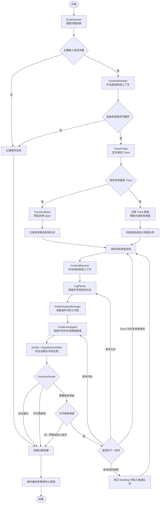
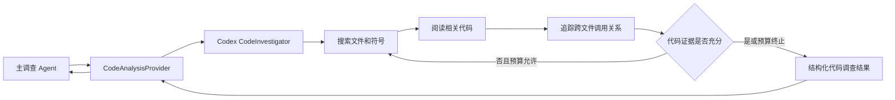
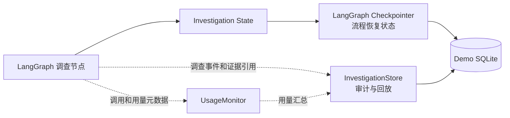

# 调查状态流转设计

## 1. 文档目标

本文描述第一版 PfinderWithAI 的 LangGraph 调查状态图，重点说明：

- 调查节点及其执行顺序。
- 节点之间传递的最小状态。
- 证据不足、跨系统调查和异常降级时如何循环。
- LangGraph Checkpointer、InvestigationStore 和 UsageMonitor 的职责位置。

本文暂不定义公司内部 API 字段、数据库表结构、具体模型或预算默认值。

## 2. 主调查状态图

图中省略了 Provider 内部的有限重试。临时错误由 Provider 按统一策略重试；确定性错误直接返回主流程，由 DecisionRouter 决定降级或终止。

TraceAnalyser 输出的是按异常程度和证据价值排序的候选调查目标，而不是已经确认的根因系统。当前目标无法形成根因时，DecisionRouter 可以选择 Trace 队列中尚未调查的候选；只有日志或代码发现 Trace 中不存在的系统、异步调用或外部依赖时，才创建 `NextHop`。

## 3. CodeInvestigator 子 Agent 边界

CodeInvestigator 是主调查 Agent 调用的 Codex 子 Agent。它可以在单次委派内部多轮搜索代码，但不会自行决定跨系统调查，也不会直接访问生产日志。

主状态只接收结构化代码证据、根因候选、未决问题和补充证据请求，不保存 Codex 的完整内部对话和搜索过程。

## 4. 最小调查状态

LangGraph 状态用于保存“一次调查当前进行到哪里”，概念上分为以下几组：

| 状态分组 | 主要内容 | 说明 |
| --- | --- | --- |
| 问题输入 | 原始问题、现象、业务 Key、起始系统、时间范围 | 由 ClueExtractor 产生 |
| 系统上下文 | 当前系统、Git 仓库与版本引用、日志和 Pfinder 标识 | 由 ContextResolver 补全 |
| Trace 状态 | 候选 Trace、关键 Span、筛选依据 | 保存结构化摘要和来源引用，不保存无关原始数据 |
| 调查目标 | 有序候选目标队列、当前目标、目标来源、接口或方法入口 | 目标来源区分 Trace 候选和新发现依赖 |
| 证据与假设 | Trace、日志和代码证据，根因候选及证据缺口 | 证据采用追加和去重语义 |
| 验证状态 | 支持证据、冲突证据、缺失证据、验证范围 | 由统一 Verifier 更新 |
| 流程控制 | 当前步骤、已访问系统、待执行动作、终止原因 | 防止循环和重复调查 |
| 运行信息 | 错误、重试、降级、累计用量 | 与 UsageMonitor 和调查轨迹关联 |

主状态不保存完整生产日志、完整代码仓库内容、完整 Prompt、访问凭证或 CodeInvestigator 的内部对话。

## 5. 节点读写边界

| 节点 | 主要读取 | 主要写入 |
| --- | --- | --- |
| ClueExtractor | CLI 原始输入 | 问题输入、缺失项、不确定项 |
| ContextResolver | 问题输入、当前目标系统 | 系统上下文、系统解析候选 |
| TraceFinder | 问题输入、系统上下文 | 候选 Trace、Trace 查询证据或缺失原因 |
| TraceAnalyser | 候选 Trace | 关键 Span、有序候选目标队列、Trace 证据 |
| LogParser | 问题输入、调查目标、补充证据请求 | 脱敏日志证据、日志查询结果状态 |
| GitWorkspaceManager | 系统上下文中的仓库和版本引用 | 临时工作区引用、版本假设或准备错误 |
| CodeInvestigator | 临时工作区、关键 Span、脱敏日志证据、调查预算 | 代码证据、根因候选、未决问题、补充证据请求、新发现依赖 |
| HypothesisVerifier | 根因候选、全部证据、验证范围 | 验证结果、冲突和证据缺口 |
| DecisionRouter | 验证结果、候选目标队列、已访问系统、错误和累计用量 | 下一动作、当前目标、NextHop、执行状态、终止原因 |
| ResultBuilder | 当前完整调查状态 | 最终 DiagnosisResult |

节点只能修改自己负责的状态部分。Provider 的原始响应先转换为领域对象，再进入主状态，不能将供应商 SDK 对象直接放入 LangGraph State。

## 6. 关键循环和终止条件

DecisionRouter 根据 Verifier 的结果选择后续路径：

| 条件 | 下一步 |
| --- | --- |
| 证据相互印证且验证通过 | 构建最终结果 |
| 缺少日志证据 | 返回 LogParser |
| 缺少代码证据或需要验证其他代码路径 | 再次调用 CodeInvestigator |
| 当前目标不是根因，Trace 中仍有未调查候选 | 从有序候选队列选择下一个目标 |
| 日志或代码发现 Trace 外的新系统或外部依赖 | 创建 NextHop，加入候选队列后补全目标上下文 |
| Trace 缺失或不完整 | 保留缺失事实，沿日志和代码降级调查 |
| 达到深度、时间、调用次数或 Token/成本预算 | 使用当前最佳假设构建结果 |
| 没有可靠候选或不存在可执行的下一步 | 以 UNRESOLVED 构建结果 |

跨系统循环必须更新已访问系统集合。再次遇到同一系统时，只有存在新的目标入口或新证据请求才允许继续，否则视为循环并终止该分支。`NextHop` 专指调查过程中新发现且不在当前 Trace 候选队列中的依赖，不用于表示普通的候选目标切换。

## 7. 执行状态与诊断结论

流程执行状态和诊断结论是两个不同维度：

- 执行状态表示工作流是否正在运行、等待输入、正常完成或因系统错误失败。
- 诊断结论表示证据是否足以支持根因，使用 `VERIFIED`、`SUPPORTED_HYPOTHESIS` 或 `UNRESOLVED`。

例如，工作流可以正常完成，但诊断结论为 `UNRESOLVED`；也可以因为用户输入缺失而等待补充，而不是把它标记为系统失败。

## 8. 持久化与监控关系

- Checkpointer 保存恢复图执行所需的状态。
- InvestigationStore 保存面向审计和回放的调查轨迹。
- UsageMonitor 保存调用次数、耗时、错误、重试及可获得的 Token/成本信息。
- 三者可以在 Demo 中共用一个 SQLite 文件，但接口和职责保持分离。

## 9. 暂缓设计项

以下内容等待实际开发或内部 API 能力明确后补充：

- Pfinder、日志和系统元数据 API 的具体请求与响应字段。
- LLMProvider 的供应商、模型和认证方式。
- 具体预算默认值。
- Python 类型的完整字段定义与校验规则。
- SQLite 表结构和迁移方案。
